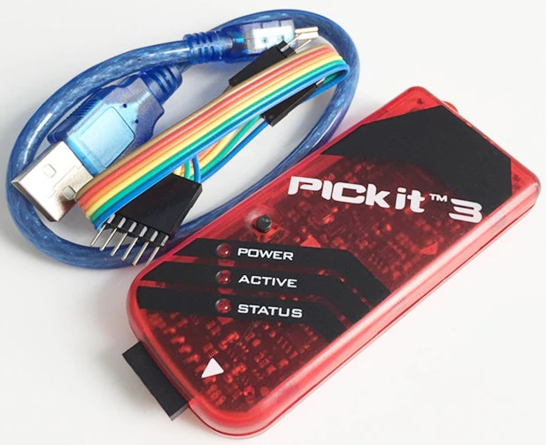

# 12F675-Development-board

The PIC12F675 is an 8 pin PIC microcontroller with 6 GPIO pins.  

This repository is for collecting "C" programs (XC8) that can be used to program the PIC12F675 development board as seen in the picture below (via the MPLAB X IDE)   

Please note:
 - The following "C" programs are stored in folder "CODE" of this repository  
   - main_01_LED  
   - main_02_Interupt 	 
   - main_03_timer 	 	 
   - main_04_ADC 
- When you buy this board, you only get what you see in the picture below - a blue coloured development board with a 12F675 pic chip already installed and a black USB (power only) supply cable that connects to the board's black barrel connector. 
 - To program the installed pic chip using this board, you also need a "pickit 3" device which connects to the boards white housing ISCP interface via a 6 wire dupont harness. (See below for more information about this) 
 - There are 2 ways to supply regulated 5V to this dev board. (N.B. There is no power supply regulator onboard - do not exceed 5V)
   - via the supplied black USB to Barrel connector cable. 
   - Via the "Pick it 3" Device  - Try to avoid using this technique - The voltage supplied to the board from the "Pickit 3" device can be lower than 5V with the MPLAB X IDE detecting this and reporting it as a fatal error. This seems to happen more with "Pickit 3" clones. 

# Development Board Schematic information
The Schematic for this board is pictured below and it has the following components:
 - Power switch      - This on/off power switch is connected to the barrel connector 
 - "Poweron" LED     - It is always on when power is applied to the board (annoyingly bright !!)
 - PIC Socket        - There should be an 8 pin 12F675 chip installed in this socket
 - Two LEDS          - Linked via yellow jumpers to pins GP0, GP1
 - Three switches    - Linked via yellow jumpers to pins GP2, GP3, GP5 (N.B. GP3 is the MCLR pin - To avoid hassles, only use it as an input pin)
 - Variable resistor - Linked via yellow jumper  to pin  GP4  
 - ICSP pins         - White housing of 6 pins - used for the programming interface
 - 8 jumpers         - Except for the "VDD" and "Ground" jumpers, removing a jumper disconnects the pic's GPIO pin from its associated LED/switch/variable resistor. This means you can connect a standard female dupoint wire to any of these now exposed header pins to whatever you want.  As mentioned earlier, The exception to this are the "VDD" and "Ground" jumpers because for these 2 jumpers, the pin pairs are connected by a track underneath the board anyway. This means that you can remove these jumpers with no ill effect and use the now exposed header pins to connect 5V or 0V respectively - to whatever external devices you want to connect to 

# "Pickit 3" device
If you want to program the board as per these examples, you will also need a "Pickit 3" device like the red one you see in the picture below - If you haven't already got one, make sure you buy it at the same time as you buy the Development board. N.B. The clones seem to work OK. 

The "Pickit 3" device connects to your PC via a (blue) USB cable and to the development board via the supplied 6 wire cable harness to the 6 pins in the board's ISCP white housing. You must use this 6 wire cable harness because you can't directly attached the "Pickit 3" to the board - the white housing prevents this.

# How to get familiar with this board
- View Julian's excellent series of videos for a great introduction to this development board, and also about a fix you should do. Ideally, you should cut a track on the board and reconnect the track by soldering a connecting wire underneath the board
  - PIC Assembly Language Tutorials: #0 - Shopping List & Mods
    - https://www.youtube.com/watch?v=p2rZwR9oM_k
  - PIC Assembly Language Tutorial: #1 - Config and Clock
    - https://www.youtube.com/watch?v=491StrMyqa4&t=1392s
  - PIC Assembly Language Update: #1.1 - PCB schematic
    - https://www.youtube.com/watch?v=TneWtGyar6M&t=192s

# How to set up and install the software and componenets
The above videos cover this - alternatively, follow the steps below
- On your PC, 
  - Download and install both the MPLAB X IDE and XC8 compiler from the MPLAB website (It is free) 
  - Plug in the black USB power cable and connect it to your 12F675 development board (This cable is only used for powering the board) 
  - Plug in the blue USB cable of Pick-it" device and ensure that the 6 wire harness leads are inserted into the board the right way round  (N.B. The pin marked VPP on the board should connect to the pin marked with a white triangle on the "Pick-it" device  

# How to Program the pic12f675 using the development board
- Ensure you are setup as per the previous section
- In this GITHUB repository
  - Look in folder "CODE" and decide which of the programs you want to program into your PIC12F675 e.g. "main_01_LED"
- On your PC, execute MPLAB X and:
  - Create a new standalone project for PIC12F675 naming it the same as the program you want to use e.g. "main_01_LED". As part of this process, you select the XC8 compiler and the "Pick-it" programming device that is a attached 
  - Highlight section called "Source Files"and right click to create a new "Main C" file. Use a name simliar to the project above e.g. "main_01_LED.c"  
  - Copy and paste the code into this new "Main" file and save it (The code comes from the Github Repository you looked at previously)
  - Press "Make and Program" to program the PIC using a Pickit 3 programmer
  - Enjoy your programmed device

# Other variants of this pic with the same pinout (6 GPIO pins)
- 12F675  - internal clock of  4 MHz
- 12F683  - Internal clock of 16 MHz
- 12F1840 - 4K words and internal clock of 32 MHz

# Other places to get information
 - GettingBlinky with assmebler
   - https://leap.tardate.com/pic/gettingblinky/
 - Watchdog info   
   - https://www.youtube.com/watch?v=tPUwuX4tHOw 

